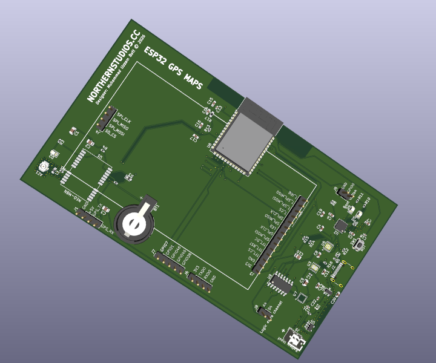

[](https://opensource.org/licenses/MIT)
[](https://www.kicad.org/)
[](https://flask.palletsprojects.com/)
[](https://github.com/ellerbrock/open-source-badges/)

# ESP32-S3 Offline GPS & Map Downloader
**Designed by Muhammad Uzzam Butt // Made for [HC Offtrack YSWS](https://offtrack.hackclub.com/)**

A hardware-focused project developed for the Hack Club community. This repository contains the complete production-ready hardware design files for a custom 4-layer printed circuit board alongside a local web-based tile extraction tool optimized for generating offline map datasets.

## Hardware Overview

<p align="center">
  
</p>

The core of the project is an optimized 4-layer PCB using a multi-rail power distribution network and an isolated RF frontend designed to maintain signal integrity across high-speed digital and highly sensitive analog circuits.

### Circuit Architecture & Subsystems

* **Main Processor:** ESP32-S3-WROOM-1 module hosting the primary system buses, driving peripheral interfaces over SPI/I2C, and featuring an explicit copper keepout zone beneath the onboard PCB antenna to maximize wireless transmission efficiency.
* **GNSS / RF Frontend:** u-blox NEO-M8N positioning engine paired with an onboard U.FL connector for external active or passive antennas. The RF microstrip line is impedance-matched to 50 Ohms with a continuous, unbroken Layer 2 Ground reference plane beneath the entire path to suppress stray noise.
* **Inertial Navigation:** ICM-20948 9-axis IMU integrating a 3-axis gyroscope, 3-axis accelerometer, and 3-axis magnetometer for dead reckoning assistance.
* **Logic Level Translation:** TXS0104 4-bit bidirectional voltage-level translator handling safe high-speed communication between the 1.8V domain of the IMU and the 3.3V native logic level of the ESP32-S3.
* **Power Management Network (PMIC):**
  * **Charging Circuit:** MCP73871 LiPo charge management controller featuring dynamic power path management (System Load Sharing) to seamlessly transition power between USB/DC input and battery power.
  * **System Regulator (3.3V):** TPS63001 high-efficiency buck-boost converter supplying a stable 3.3V rail capable of absorbing the heavy transient current spikes during ESP32 Wi-Fi bursts.
  * **Sensor Regulator (1.8V):** AP2112K-1.8V low-dropout (LDO) linear regulator dedicated exclusively to isolating the sensitive analog components inside the IMU from digital switching noise.
  * **RTC Backup:** CR1220 coin cell retention circuit directly biasing the `V_BCKP` pin of the NEO-M8N to ensure warm/hot start capability and rapid orbital position locks.
* **User Interfaces & Storage:**
  * High-density micro-SD card slot attached via dedicated SPI lines for reading map tiles.
  * Custom TFT display expansion pin header broken out with hardware control lines (`CS`, `DC`, `RST`, `LED`).
  * Supplemental GPIO expansion breakouts (`GPIO7`, `GPIO2`, `GPIO46`, `GPIO45`, `GPIO38`) alongside a dedicated hardware UART interface (`TXD0`/`RXD0`) for diagnostics.

---

## Software: Map Tile Downloader

To support the offline hardware operation, a standalone map utility is provided to extract spatial tiles directly from web tile servers into an indexed directory structure ready for deployment to external storage media.

### Technical Stack
* **Frontend:** HTML, JavaScript, Leaflet.js rendering canvas, Leaflet.draw interface library configured with an orange, dashed polygon utility to visualize map coordinates.
* **Backend:** Python web server powered by the Flask micro-framework utilizing standard math libraries to translate mercator coordinates into standard XYZ tile grids.
* **Data Provider:** CartoDB Voyager raster tile api.

### Installation & Operation

1. Navigate to the code directory containing the script assets.
2. Install the necessary networking dependencies via pip:
   ```
   pip install flask requests

 3. Initialize the local Flask loop:
   ```
   python app.py
   
   ```
 4. Point a web browser to http://127.0.0.1:5000.
 5. Use the rectangle bounding tool to drag a perimeter over the geographical region you want to download.
 6. Trigger the download pipeline; files are compiled directly into the root folder under
    ```
    /downloaded_maps/{zoom}/{x}/{y}.png
    ```
